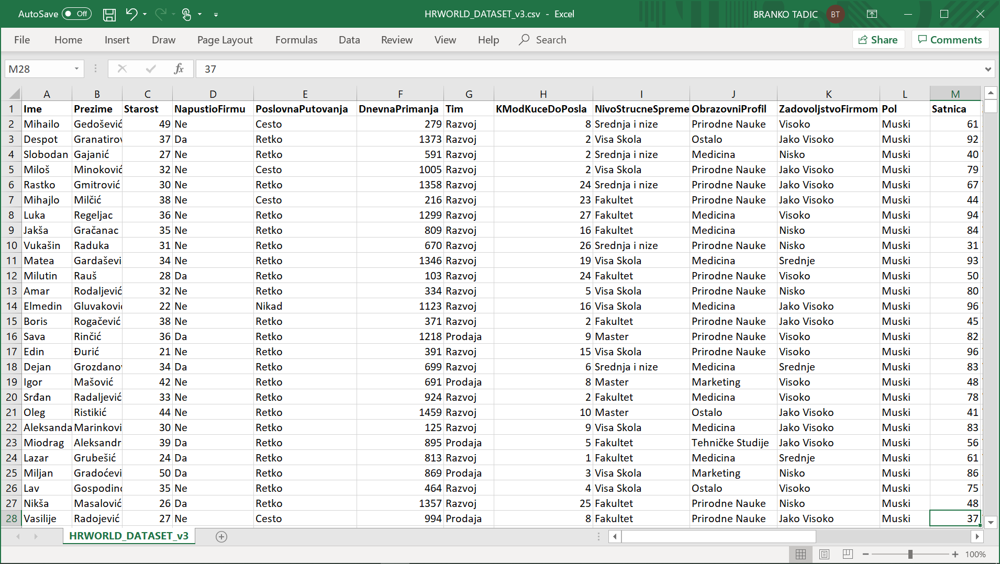
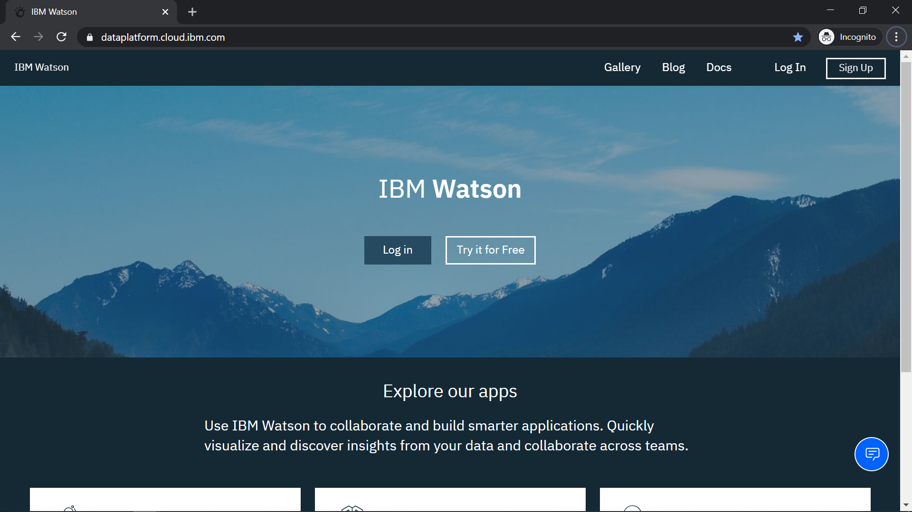
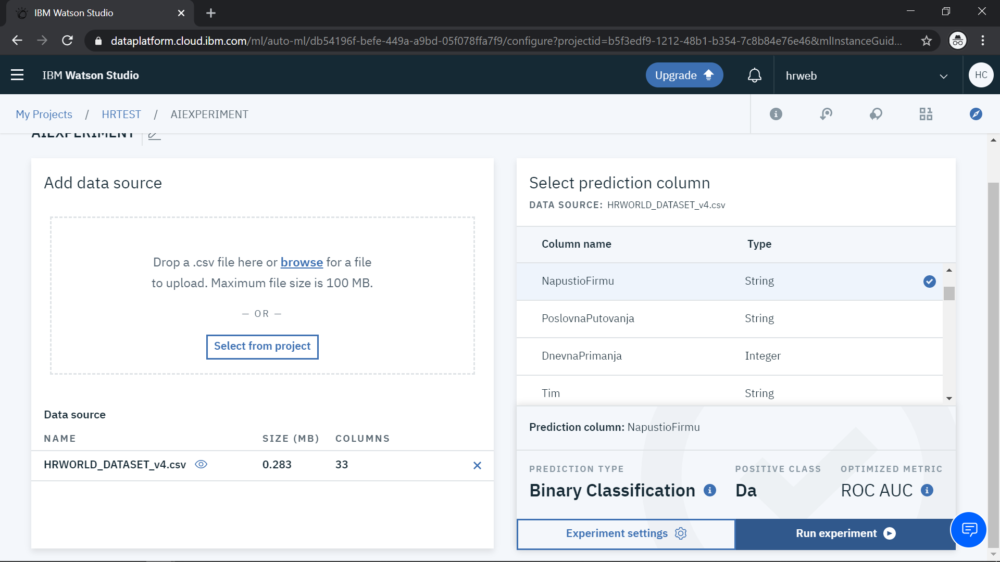
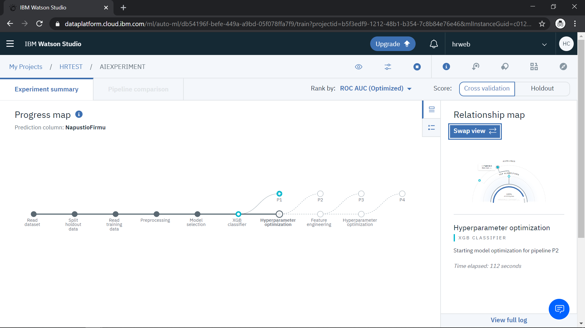
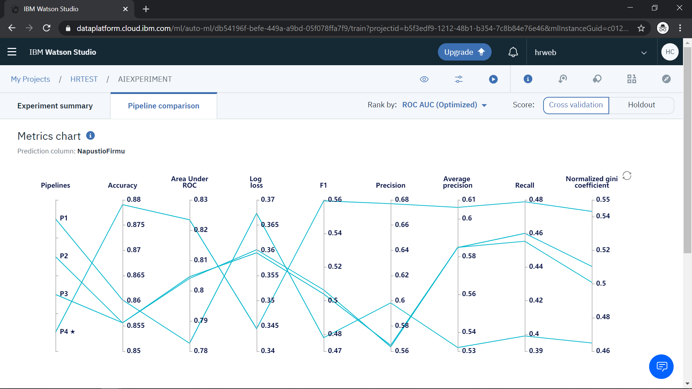
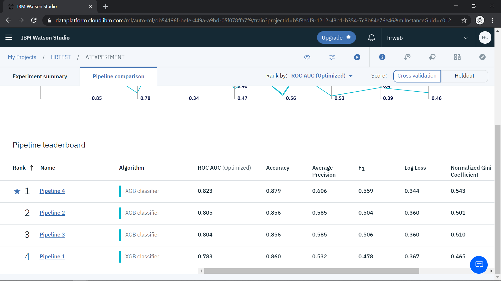
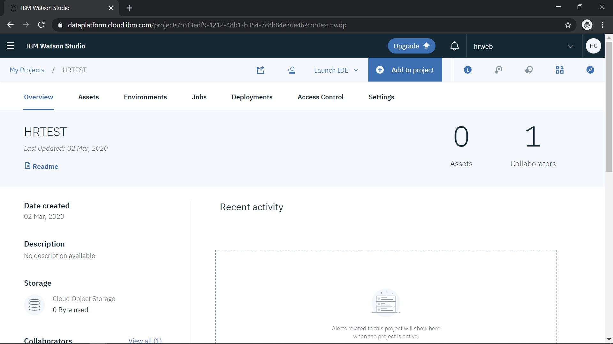
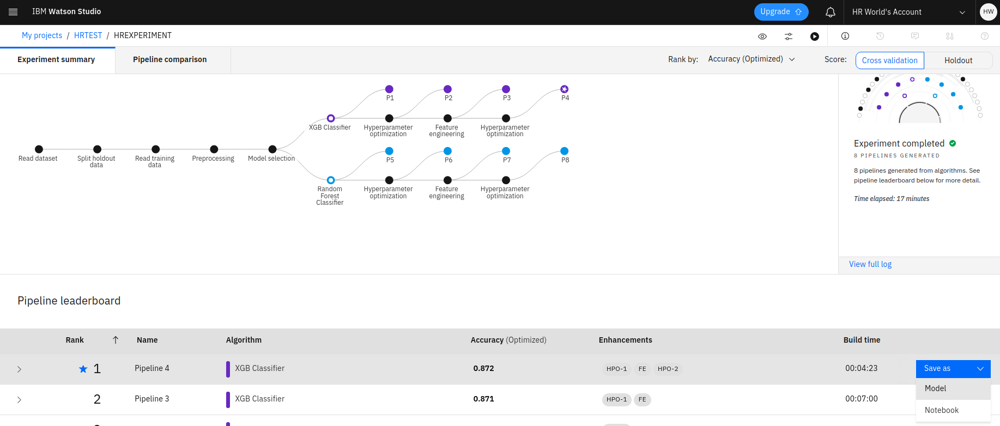

**DIY AI**

*Kako da sami, bez ikakvog predznanja, napravite aplikaciju na bazi
mašinskog učenja koja će Vam pomoći da predvidite i sprečite odlazak
ključnih zaposlenih iz firme?*

  - *Branko Tadić*

**Ali.. hoću li ja ovo moći?**

Ovaj tekst smo pripremili imajući u vidu da naš čitalac/čitateljka ne
mora biti “IT guru”. Budite uvereni da ćete, bez obzira na nivo
predznanja u radu sa računarima, popunjavanjem jednostavnog Excel fajla
i praćenjem uputstava korak po korak, moći da na jednostavan način
dođete do rezultata koji će, nadamo se, biti vredan ne samo Vaše
pažnje, već i pažnje menadžmenta Vaše kompanije. Nije nam ideja da će
HR biti neko ko kreira i razvija ovakve aplikacije već da će menadžment,
ukoliko uvidi benefite informacija koje im na ovaj način možete pružiti,
odlučiti da zaduži IT odeljenje da implementira neko od rešenja ovog
tipa. Za početak će Vam biti potreban samo besplatan nalog na IBM Watson
Studio portalu (uputstvo za otvaranje naloga je dato ispod).

**Ima li veštačka inteligencija mesto u HR-u?**

Kada razmišljamo o komunikaciji između čoveka i mašine, naš instinkt nam
govori da samo ljudsko biće može u potpunosti da razume i ostvari
kvalitetnu komunikaciju sa drugim ljudskim bićem. Ovo se pokazalo tačnim
i u doba naprednih računara i veštačke inteligencije. No, veštačka
inteligencija je ipak našla značajno mesto i u oblasti HR-a, time što je
omogućila HR poslenicima i njihovim klijentima (zaposlenima) **lakši
pristup ključnim informacijama**, što sam kvalitet direktne komunikacije
(bilo da je u pitanju intervju pri zapošljavanju, godišnja procena ili
rešavanje situacije u privatnom životu) podiglo na dodatni nivo. IBM kao
jedna od najvećih svetskih IT kompanija ima dugu tradiciju
implementacije HR rešenja, a u poslednjih nekoliko godina sve veći broj
tih rešenja imaju elemente veštačke inteligencije. To iskustvo nam je
omogućilo da izdvojimo nekoliko tipičnih primena veštačke inteligencije
u HR domenu:

  - Automatizovani asistenti (chatbot-ovi) koji zaposlenima, uz uvid u
    kompanijske procedure i baze podataka, odgovaraju na često
    postavljana pitanja, bez potrebe da HR veliki deo svog vremena troši
    na ovo

  - Automatizacija pronalaženja i personalizacija kontakta sa talentima,
    razumevanje profila i motivacije kroz automatizovane intervjue ili
    analizu snimaka intervjua uživo, prilagođavanje komunikacije, ponude
    i poruka u svrhu zapošljavanja top talenata

  - Praćenje i prilagođavanje optimalnih uslova rada i kompenzacije, kao
    i putanje karijere za svakog zaposlenog, na osnovu analize
    istorijskih podataka kompanije ali i spoljnih informacija (ponuda na
    tržištu, trending znanja itd)

  - Automatizovano praćenje i procena rezultata rada kao i nivoa znanja
    i stručnosti, te personalizovana priprema paketa treninga za svakog
    zaposlenog usmerenih ka postizanju ciljeva zaposlenog i kompanije

  - Podrška HRu i menadžmentu kompanije u donošenju pravilnih odluka,
    automatizovanim prikupljanjem i pripremom relevantnih informacija
    (jedan od takvih slučajeva obrađujemo u ovom članku)

Neki od konkretnih primera benefita primene veštačke inteligencije u
sferi HR dati su u PWC studiji “Artificial Intelligence in HR: A
no-brainer" (
<https://www.pwc.nl/nl/assets/documents/artificial-intelligence-in-hr-a-no-brainer.pdf>
), za potrebe ovog članka izdvajamo detalje studije slučaja kompanije
L’Oreal, koja ima preko 80,000 zaposlenih u preko 15,000 kandidata
koji godišnje prolaze kroz recruitment proces:

  - Primenom automatizovanih AI rešenja **hiring proces je postao 10
    puta brži**

  - Sa istim HR resursima kompanija sada može da intervjuiše **25% više
    kandidata**

  - Zadržavanje ključnog kadra u kompaniji (retention) je **povećan za
    25%**

  - Kvalitet procesa automatske idenfikacije I skrininga talenata pomoću
    AI algoritama je toliki da **čak 82% kandidata koji su pozvani na
    finalni intervju na kraju dobije ponudu za posao** u L’Oreal-u.

**Sve počinje pravim pitanjem**

Kao i kod bilo kog drugog tipa problema, put do rešenja počinje time da
se postave relevantna pitanja. U ovom slučaju, tehnologija koju
koristimo je zasnovana na statističkim modelima i (relativno) velikom
skupu istorijskih podataka, pa je samim tim veoma bitno da znamo na koje
pitanje dajemo odgovor, i da li uopšte posedujemo podatke koji su nam za
to potrebni.

Problem koji u ovom primeru rešavamo odnosi se na „predviđanje“
mogućnosti da će neki od naših ključnih zaposlenih napustiti kompaniju
(što nam daje mogućnost da HR pravovremeno reaguje i potencijalno spreči
takav ishod). Zaposleni kompaniju napuštaju iz različitih razloga, od
visine kompenzacije do narušenih međuljudskih odnosa ili nezadovoljstva
mogućnostima profesionalnog razvoja, često je u pitanju i kombinacija
tih činilaca. Zato je pitanje koje ćemo mi postaviti našem sistemu
veštačke inteligencije sledeće: Kolika je verovatnoća da će
***određeni zaposleni*** napustiti ***trenutno radno mesto***? Naravno,
ukoliko nam sistem ukaže da je za nekoga verovatnoća posebno visoka, eto
nama posla za HR.

U ovom pitanju treba uočiti šta su izlazi modula mašinskog učenja, tj.
koji su poslovni ishodi od interesa. U ovom slučaju imamo dva ishoda:
zaposleni napustio kompaniju, ili zaposleni nije napustio kompaniju.
Samim tim, naši istorijski podaci obavezno moraju da sadrže tu kolonu.
Sa druge strane, biće nam potrebni i podaci koji opisuju pojam
***„određeni zaposleni“*** (što su odlike zaposlenog kao persone,
nevezano od zaposlenja: pol, godine, bračna situacija, razdaljina
kuća-posao i sl), kao i pojam ***„trenutno radno mesto“*** (što su
stvari povezane sa vrstom posla koji zaposleni trenutno radi i
njegovim/njenim trenutnim statusom u firmi: pozicija, kompenzacija,
menadžer, količina putovanja i sl).

**Šta nas čeka u pohodu do veštačke inteligencije?**

Metodologija izrade našeg AI “HR savetnika” prikazana je na grafikonu
ispod:

> Aktivnosti se odvijaju u nekoliko faza:

  - Prikupljanje podataka unutar Vaše kompanije (iz HR baza, Excel
    fajlova, dokumenata) - ovo je ujedno i najmukotrpniji deo posla
    ukoliko nemate dobro organizovano softversko rešenje za HR

  - Izrada AI modela na osnovu prikupljenih podataka u alatu IBM Watson
    Studio na cloud-u

  - Aktivacija (deployment) modela u Cloud kako bi mogao da izvršava
    upite

  - Testiranje modela unosom podataka koji nisu bili u trening setu

  - (Opciono) Integracija modela sa Vašom HR aplikacijom (ili recimo
    izrada zasebne Web ili Mobilne aplikacije samo za ovu svrhu). Ovaj
    korak nije pokriven u članku, već ga možete realizovati u saradnji
    sa Vašim IT odelenjem, kada uvidite poslovnu vrednost modela.

U nastavku teksta dajemo detaljne korake izrade i aktivacije AI modela,
uz najbolje prakse koje prate ovu metodologiju.

**Kako naći relevantne podatke?**

Ovo je, realno, i najteži korak u ovom našem primeru – prikupljanje
relevantnih HR podataka može biti izuzetno lako (ako imate dobro
organizovan HR sistem sa mogućnošću izvoza podataka u Excel formatu),
ili pak izuzetno teško (ako formiranje Excel-a podrazumeva prekopavanje
papirne arhive i ručni unos podataka), ali se u svakom slučaju mora
postaviti pitanje **kvaliteta** i **kvantiteta** ulaznih podataka.

Kad je reč o **kvalitetu** podataka, podrazumevamo da trening podaci
budu dovoljno sadržajni (u smislu pokrivanja svih različitih tipova
situacija i scenarija, odn. vrednosti koje kolone u Vašem Excelu mogu
imati), ali bez nepotrebnih ponavljanja (što usporava i usložnjava
krajnji model). Nekoliko preporuka:

  - Da bi pravilno formirali model mašinskog učenja, u trening podacima
    morate imati dovoljnu zastupljenost različitih poslovnih ishoda za
    koje radite predviđanje. U ovom konkretnom slučaju, morate imati
    kolonu koja pokazuje da li je zaposleni napustio kompaniju (sa
    vrednostima Da ili Ne), i u njoj morate imati i određeni broj onih
    koji su to u prošlosti učinili, kako bi model „shvatio“ pod kojim
    okolnostima se to dešava (okvirna preporuka je da takvih slučajeva
    bude bar 10-20 u trening podacima, inače cela operacija nema smisla
    – ako imate troje ljudi koji su do sada napustili kompaniju, bolje
    „ručno“ proučite svaku od njihovih situacija i donesite zaključke).

  - Iz Vašeg Excel fajla izbacite sve kolone koje su potpuno prazne ili
    imaju svuda istu vrednost (npr. ako imate kolonu „Radna Lokacija“ i
    vrednost je „Beograd“ za sve zaposlene, ona ni na koji način ne
    doprinosi kvalitetu modela)

  - Izbacite sve kolone koje imaju manje od 10% popunjenih redova, i za
    koje ne očekujete da mogu na bilo koji način doprineti kvalitetu
    predviđanja (npr kolona u kojoj stoji kada je zaposleni izvršio
    sistematski pregled verovatno nema nikakvog uticaja na verovatnoću
    odlaska iz firme /ako mislite drugačije, eto ideje za novi primer /)

  - Izmenite sve datumske vrednosti tako da budu izražene celim ili
    decimalnim brojem (npr umesto datuma zaposlenja gde imate vrednosti
    poput 01.03.2018. napravite kolonu Godine službe, u kojoj će pisati
    2)

  - U svim kolonama koje mogu uzeti samo određeni skup vrednosti (npr.
    Odsek može biti Prodaja, Magacin ili Opsta Sluzba), prečistite
    podatke tako da recimo „Prodaja“, „prod.“, „prodajno“ i sl. budu
    zamenjene samo jednom jedinstvenom vrednošću, npr. „PRODAJA“

  - Izbacite sve kolone koje sadrže podatke koji su jedinstveni za svaku
    individuu (npr JMBG ili kućna adresa) jer one ne doprinose kvalitetu
    modela. Ostavite samo jednu, po kojoj ćete lako identifikovati o kom
    zaposlenom se radi ako ga model rangira kao visoko rizičnog (to može
    biti puno ime i prezime, serijski broj zaposlenog i sl)

**Kvantitet** potrebnih podataka umnogome zavisi od sadržajnosti samih
podataka (videti iznad) i izabranog tipa modela (matematičkog
algoritma), a čak se ni najveći Data Science stručnjaci ne usuđuju da
olako unapred daju procene koliko Vam podataka treba za „dobar“ model.
Dobra vest je da, kada jednom napravite model, postoji način da izmerite
njegov kvalitet/pouzdanost, što Vam daje mogućnost da eksperimentišete
sa različitim veličinama trening podataka i uporedite dobijene
rezultate.

  - U našem primeru, pripremili smo trening Excel od oko 1,500 redova, u
    kome su dobro zastupljena oba poslovna ishoda koje posmatramo (oko
    240 zaposlenih koji su, istorijski, napustili firmu, i svi ostali
    koji nisu).

  - U nekim drugim slučajevima možete koristiti grubu preporuku iz
    prakse koja kaže da broj redova treba da bude minimalno 10 puta veći
    od broja kolona/parametara u Excelu (u našem primeru imamo 32
    kolone, i dosta više od minimalnih 10\*32=320 redova, tako da smo
    ok).

**Magija počinje**

Kada smo jednom sakupili podatke, ostatak procesa se odvija poprilično
jednostavno. Iako ćemo za kreiranje modela koristiti jedan jako moćan
alat, IBM Watson Studio, koji ima na hiljade opcija i različitih
mogućnosti za obradu podataka i veštačku inteligenciju, mi ćemo ga
koristiti u režimu namenjenom početnicima, te neće biti potrebe za bilo
kakvim programiranjem niti drugim kompleksnim operacijama. Kada model
jednom bude napravljen, ostaje nam samo da ga koristimo, na krajnje
jednostavan način – unosom upita u Web formular.

Primer testnih podataka koji ćemo koristiti odnosi se na fiktivnu srpsku
kompaniju. Podaci se mogu naći u Excel fajlu koji će Vam biti na
raspolaganju za download sa stranice sa uputstvom korak-po-korak, na
koju možete doći skeniranjem ili QR koda iz ovog članka, ili ukucavanjem
sledeće adrese u Vaš Web pregledač: ibm.biz/estimator .

Taj Excel fajl izgleda ovako:

Kao što možete videti, fajl sadrži različite podatke o zaposlenima koji
su od nastanka firme bili, ili su još uvek, zaposleni u njoj. Možete
slobodno iskoristiti ovaj fajl za formiranje Vašeg trening seta,
jednostavno zamenite podatke pravim podacima iz Vaše firme, izbrišite
kolone za koje nemate podatke, dodajte neke nove po potrebi, ali je
bitno da u svom fajlu morate imati kolonu koja pokazuje ko je od
zaposlenih u prošlosti napustio firmu (kod nas je to kolona D,
***NapustioFirmu***).

**Upoznajte Watson Studio**

Watson Studio je rešenje kompanije IBM za naprednu analitiku i
modelovanje sistema mašinskog učenja i veštačke inteligencije (AI). Ovo
rešenje se može instalirati i u data centru kompanije, ali je za naš
primer mnogo pogodnije da ga koristimo u IBM Cloud-u, gde je već unapred
instalirano i podešeno za nas. Sve što nam je potrebno je email adresa
kojom ćemo se registrovati za besplatan nalog na ovom cloudu, što
otpočinjemo kucanjem sledeće adrese u pregledač:
<https://dataplatform.cloud.ibm.com/>

Sada sledite ove korake:

  - Kliknite na „Try it for Free“

  - U polju „Create an IBM Cloud account“ unesite Vaš email

  - Štiklirajte polje „I accept the IBM Watson Studio terms...“ i
    kliknite dugme „Next“

  - Na sledećoj stranici popunite sva polja registracione forme i
    kliknite „Create Account“

  - Dobićete email poruku sa 7-cifrenim kodom koji treba uneti u formu
    kako biste aktivirali nalog, pratite uputstva iz poruke (kliknite na
    „Confirm Account“ dugme), što će Vas odvesti direktno u Vaš Watson
    Studio nalog

  - Kliknite na „Get Started“, zatim odgledajte virtuelnu turu ili
    kliknite „Maybe later“ za nastavak

  - Sada biste trebali biti na početnom ekranu Watson Studia

  - Kliknite na „Create a project“, zatim izaberite „Create an empty
    project“

  - Dajte novom projektu ime (npr. HRTEST) i kratak opis, zatim kliknite
    na link „Add“ u sekciji „Select Storage Service“ (ovime ćete
    kreirati smeštajni prostor za vaše Excel fajlove; ovo je potrebno
    uraditi samo prilikom kreiranja prvog projekta)

  - Na ekranu „Cloud Object Storage“ na koji će Vas sistem automatski
    odvesti, proverite da li je odabrana opcija „lite“ u okviru Plan na
    dnu ekrana (desno treba da bude navedena cena „free“ ).

  - Kliknite na „Create“, zatim na „Confirm“ u pop-up prozoru, bez
    izmene ostalih vrednosti

  - U prethodnom prozoru (New Project) bi trebao da se pojavi novi
    Storage; izaberite ga, i kliknite „Create“ (ukoliko se ne pojavi
    kliknite “Refresh” da bi osvežili stranicu)

  - Sada bi trebalo da imate učitan novi prazan projekat, kao što je
    prikazano ispod

  - Kliknite na „Add to Project“, pa odaberite „AutoAI Experiment“

  - U sledećem prozoru unesite ime eksperimenta (npr. „HREXPERIMENT“) i
    opis (po želji), a zatim kliknite na link „Associate a Machine
    Learning Instance“ (slično kao iznad, prilikom prvog korišćenja ovog
    servisa treba ga kreirati iz prozora Machine Learning izborom opcije
    „lite“-„free“, zatim klikom na „Create“, pa u pop-up prozoru
    „Confirm“)

  - Sada na prethodnom prozoru kliknite na „Reload“ i nova instanca
    Machine Learning engine-a će se pojaviti; kliknite na „Create“

  - Na sledećem ekranu „Add Data Source“ kliknite na link „Browse“ i
    pronađite Vaš Excel fajl sa podacima (ili iskoristite naš primer)

  - Na sledećem ekranu, u sekciji „Select Prediction Column“ kliknite na
    kolonu u kojoj se nalazi informacija da li je zaposleni napustio
    kompaniju (u našem primeru „NapustioFirmu“); zatim kliknite na dugme
    „Run Experiment“ koje se pojavilo na dnu

> 

  - Na sledećem ekranu kliknite na „Swap view“ kako bi se u prvom planu
    pojavio prikaz faza kroz koje Watson Studio prolazi prilikom
    isprobavanja različitih varijanti modela i traženja najpreciznije
    varijacije
    
    

  - Tokom procesa će se na dnu stranice pojavljivati nove varijante
    modela koje je sistem napravio i istestirao, a biće rangirane po
    kvalitetu, na bazi tzv. Metoda karakteristične krive

> **Kako se ocenjuje kvalitet AI modela?**
> 
> Prilikom izrade modela, ulazni set podataka se deli na „trening
> podatke“ i „testne podatke“. To znači da će sistem iz Vašeg
> originalnog fajla uzeti određeni procenat redova (tipično 20%, ali
> može se izabrati i drugi procenat) i sačuvati ih za testiranje (ti
> podaci neće biti korišćeni za treniranje modela). Kada se jednom
> napravi model (korišćenjem trening podataka), tada se testnim podacima
> „meri“ tačnost modela (sistem sam unese ulazne podatke za zaposlenog
> iz testnog seta, i dobije predviđanje od modela da li će taj zaposleni
> napustiti kompaniju ili ne; zatim sistem to uporedi sa tačnim
> odgovorom kojeg već ima u ulaznim podacima, i na taj način formira
> statistiku uspešnosti određene varijante modela). Zatim sistem
> isprobava druge varijante algoritama, ili koristi dodatne metode
> optimizacije (poput Feature Engineering-a ili Hyperparameter
> optimizacije) kako bi kreirao dodatne varijante, i upoređuje koja se
> od njih najbolje pokazala pri testiranju.
> 
> Kada sistem dođe do završne tačke (P4), što u proseku traje oko 15ak
> minuta, klikom na „Pipeline Comparison“ može se videti grafičko
> upoređenje uspešnosti testiranja različitih varijanti modela.
> 
> 
> 
> Na dnu ekrana se i dalje nalazi tabela sa varijantama modela
> rangiranim po uspešnosti, gde na vrhu možemo otkriti ko je „šampion“:
> 
> 
> 
> Budući da je „Pipeline 4“ (bar u našem primeru) izdvojen kao najbolji,
> u daljem radu ćemo koristiti ovu varijaciju modela. Skrolujte skroz
> desno i u redu „Pipeline 4“ kliknite na dugme „Save as... Model“ koje
> će se pojaviti kada mišem pređete preko kolone „Recall“, kao što se
> vidi ispod:

  - U pop-up prozoru koji se pojavi prihvatite ponuđeno ime modela i
    kliknite „Save“

  - Sada kliknite na ime Vašeg projekta u gornjem levom uglu ekrana (iza
    My Projects), kako bi se vratili na početnu stranu projekta.
    Kliknite na tab “Assets”.

  - Videćete da se u sekciji „AutoAI Experiments“ pojavio Vaš
    eksperiment, kao i da se u sekciji Models na dnu strane pojavio Vaš
    snimljeni model, kao ispod:

> 
> 
> **Kako da model „oživi“**
> 
> AI modeli su, u suštini, ništa drugo nego skup (matrica) parametara po
> kojoj se može konfigurisati statistički sistem (server sa
> odgovarajućim baznim softverom), da bi za zadate ulaze dao željeni
> izlaz (slično kao što se štelovanjem niza dugmića na miks pultu u
> muzičkom studiju za određeni ulazni zvuk podešava željeni zvuk na
> izlazu). Kao što računarski program, da bi radio neku korisnu
> funkciju, treba instalirati na neki računar i pokrenuti, tako se i AI
> model pre korišćenja mora instalirati i pokrenuti na pogodnom
> računarskom sistemu (serveru), a taj proces se naziva Deployment. Da
> bi instalirali i pokrenuli naš model na instanci servera (koju smo
> konfigurisali u jednom od prethodnih koraka), treba preduzeti sledeći
> niz akcija:

  - Kliknite na ime modela (u našem slučaju AIEXPERIMENT – P4
    XGBClassifierEstimator)

  - Na sledećem ekranu odaberite tab „Deployments“, i zatim kliknite na
    „Add Deployment“

  - Na sledećem ekranu unesite ime (npr. HRMODEL) i opis (po želji), a
    zatim kliknite na „Save“

  - Sistem će Vas vratiti na prethodni prozor, gde ćete moći da pratite
    status procesa deployment-a (možete koristiti F5 s vremena na vreme
    da osvežite sadržaj ekrana)

  - U trenutku kada se status pretvori u „Ready“, Vaš model je spreman
    za testiranje:

  - 

  - Kliknite na ime modela (u ovom primeru HRMODEL) , a zatim odaberite
    tab „Test“, kao ispod

  - U sekciji „Enter Input Data“ unesite podatke za nekog zaposlenog
    koji nije bio u originalnom Excel fajlu (to može npr biti novi
    zaposleni, ili podaci kandidata kojeg razmišljate da zaposlite),
    recimo mi smo uneli sledeći set podataka:

<table>
<tbody>
<tr class="odd">
<td><table>
<thead>
<tr class="header">
<th>Ime</th>
</tr>
</thead>
<tbody>
<tr class="odd">
<td>Prezime</td>
</tr>
<tr class="even">
<td>Starost</td>
</tr>
<tr class="odd">
<td>PoslovnaPutovanja</td>
</tr>
<tr class="even">
<td>DnevnaPrimanja</td>
</tr>
<tr class="odd">
<td>Tim</td>
</tr>
<tr class="even">
<td>KModKuceDoPosla</td>
</tr>
<tr class="odd">
<td>NivoStrucneSpreme</td>
</tr>
<tr class="even">
<td>ObrazovniProfil</td>
</tr>
<tr class="odd">
<td>ZadovoljstvoFirmom</td>
</tr>
<tr class="even">
<td>Pol</td>
</tr>
<tr class="odd">
<td>Satnica</td>
</tr>
<tr class="even">
<td>Zalaganje</td>
</tr>
<tr class="odd">
<td>NivoOdgovornosti</td>
</tr>
<tr class="even">
<td>RadnoMesto</td>
</tr>
<tr class="odd">
<td>ZadovoljstvoRadnimMestom</td>
</tr>
<tr class="even">
<td>BracniStatus</td>
</tr>
<tr class="odd">
<td>MesecnaPrimanja</td>
</tr>
<tr class="even">
<td>PrethodnihPoslova</td>
</tr>
<tr class="odd">
<td>DostaPrekovremeNegRada</td>
</tr>
<tr class="even">
<td>ProcenatPovecanjaPlate</td>
</tr>
<tr class="odd">
<td>OcenaRezultataRada</td>
</tr>
<tr class="even">
<td>OdnosSaMenadzerom</td>
</tr>
<tr class="odd">
<td>UdeoUVlasnistvu</td>
</tr>
<tr class="even">
<td>GodineStaza</td>
</tr>
<tr class="odd">
<td>BrojObukaProsleGodine</td>
</tr>
<tr class="even">
<td>WorkLifeBalans</td>
</tr>
<tr class="odd">
<td>GodineUKompaniji</td>
</tr>
<tr class="even">
<td>GodineNaTrenutnomPoslu</td>
</tr>
<tr class="odd">
<td>GodineOdUnapredjenja</td>
</tr>
<tr class="even">
<td>GodineKodTrenutnogMenadzera</td>
</tr>
</tbody>
</table></td>
<td><table>
<tbody>
<tr class="odd">
<td><table>
<thead>
<tr class="header">
<th>Slobodan</th>
</tr>
</thead>
<tbody>
<tr class="odd">
<td>Penezic</td>
</tr>
<tr class="even">
<td>44</td>
</tr>
<tr class="odd">
<td>Cesto</td>
</tr>
<tr class="even">
<td>78</td>
</tr>
<tr class="odd">
<td>Razvoj</td>
</tr>
<tr class="even">
<td>5</td>
</tr>
<tr class="odd">
<td>Fakultet</td>
</tr>
<tr class="even">
<td>Ostalo</td>
</tr>
<tr class="odd">
<td>Nisko</td>
</tr>
<tr class="even">
<td>Muski</td>
</tr>
<tr class="odd">
<td>51</td>
</tr>
<tr class="even">
<td>Visoko</td>
</tr>
<tr class="odd">
<td>Izvrsilac</td>
</tr>
<tr class="even">
<td>Manager</td>
</tr>
<tr class="odd">
<td>Srednje</td>
</tr>
<tr class="even">
<td>U braku</td>
</tr>
<tr class="odd">
<td>1560</td>
</tr>
<tr class="even">
<td>4</td>
</tr>
<tr class="odd">
<td>Da</td>
</tr>
<tr class="even">
<td>15</td>
</tr>
<tr class="odd">
<td>4</td>
</tr>
<tr class="even">
<td>Odlican</td>
</tr>
<tr class="odd">
<td>0</td>
</tr>
<tr class="even">
<td>10</td>
</tr>
<tr class="odd">
<td>1</td>
</tr>
<tr class="even">
<td>Srednji</td>
</tr>
<tr class="odd">
<td>6</td>
</tr>
<tr class="even">
<td>3</td>
</tr>
<tr class="odd">
<td>6</td>
</tr>
<tr class="even">
<td>2</td>
</tr>
</tbody>
</table></td>
</tr>
</tbody>
</table></td>
</tr>
</tbody>
</table>

  - Klikom na „Predict“ dobijamo predviđanje:

  - Procenat obeležen iznad (59.10%) se odnosi na ishod „Da“, drugim
    rečima **procena verovatnoće da će zaposleni pod trenutnim uslovima
    napustiti kompaniju je oko 59.1%**. S obzirom da je prosek rizika
    našeg čitavog seta podataka oko 16% (ovo smo dobili posebnom
    opcijom koja omogućava primenu modela na sve redove iz Excel fajla),
    dolazimo do zaključka da je ovaj naš zaposleni u popriličnom riziku
    od odlaska iz kompanije, te kako bi HR morao što pre da obavi
    razgovor sa njim (naravno, ukoliko je u interesu kompanije da ovaj
    zaposleni ostane 😊).
    
    **Šta dalje?**
    
    Od ovog trenutka možete bookmark-ovati ovu stranicu i po želji se
    vraćati na nju da napravite procenu. Naravno, u svakodnevnoj
    upotrebi bi se unos ove količine podataka mogao olakšati razvojem
    jednostavne mobilne ili desktop aplikacije koja bi slala upite
    modelu, ili bi se model mogao direktno integrisati sa Vašim HR
    sistemom, pa bi se procenat rizika za svakog zaposlenog automatski
    ažurirao i prikazivao u dosijeu zaposlenog, a upozorenja (porast
    rizika za nekog od zaposlenih) bi Vam se mogla slati na mail ili kao
    SMS poruka. Taj deo razrade nije u opsegu ovog primera (budući da bi
    nam za to ipak bilo potrebno malo programiranja), ali ukoliko uočite
    vrednost u ovakvoj primeni AI modela nad istorijskim HR podacima,
    lako ćete ubediti Vaše IT odeljenje da se upusti u razradu
    kompletnog rešenja.
    
    Naša namera je bila da Vas upoznamo sa osnovnim principima primene
    modela mašinskog učenja u HR domenu, i da Vas ubedimo kako ova
    tehnologija nije tako „svemirska“ i kompleksna kao što ste možda
    mislili. Verujemo da ćete, na bazi ovog primera, i sami smisliti
    druge praktične primene mašinskog učenja u HRu, postavljanjem novih
    zanimljivih pitanja. Neka od rešenja koja je IBM u praksi razvijao
    za svoje korisnike su navedena ispod:
    
      - Preporučena putanja učenja (learning path) za zaposlenog kako bi
        dostigao određeni tip i nivo kompetencija, a na bazi istorijskih
        podataka zaposlenih koji su već dostigli taj nivo stručnosti
    
      - Pomoć u preliminarnom izboru odgovarajućih kandidata za radno
        mesto, na bazi njihovog psihološkog profila i istorijskih
        profila top talenata kompanije u datom domenu
    
      - Pomoć zaposlenima u vidu ekspertskog „chat bota“ koji pomaže
        manje iskusnim/stručnim zaposlenima na bazi istorijskih odgovora
        iskusnijih zaposlenih
    
      - Sugestija najboljeg načina motivacije zaposlenog na bazi sličnih
        prethodnih iskustava zaposlenih u kompaniji
    
      - Sugestija optimalne kombinacije benefita i kompenzacije radi
        privlačenja/zadržavanja top talenata u kompaniji, na bazi
        istorijskih podataka i interesa kandidata, a uvažavajući
        ograničenja resursa (budžete i dostupnost benefita)
        
        Više o IBM rešenjima za Human Resources možete saznati na Web
        adresi:
        
        <https://www.ibm.com/talent-management>
